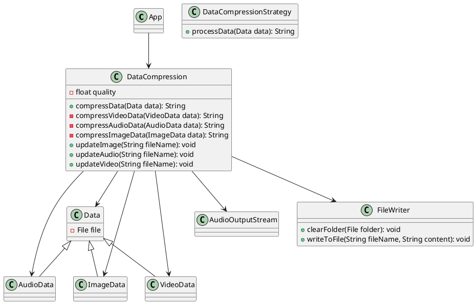
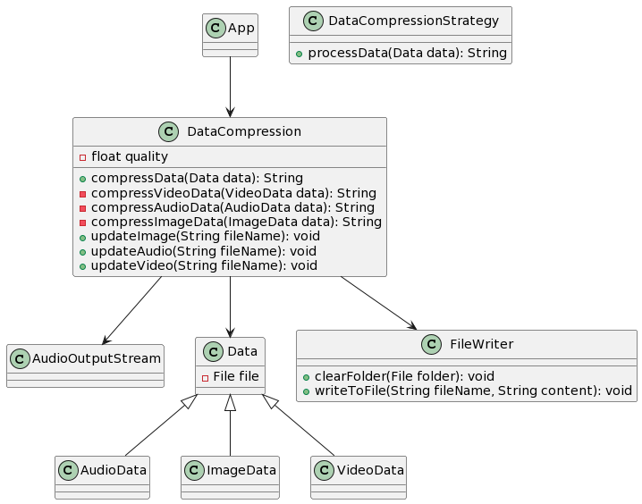
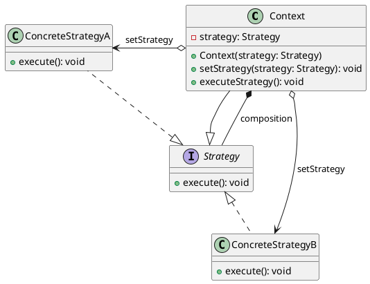
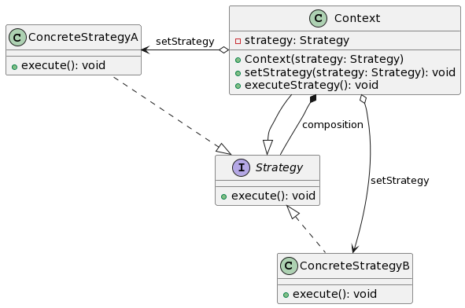
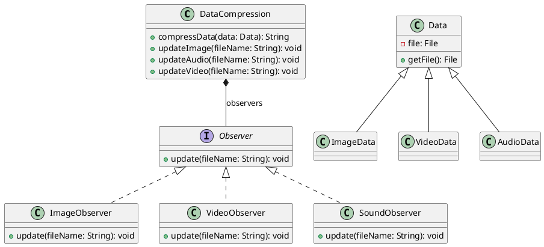
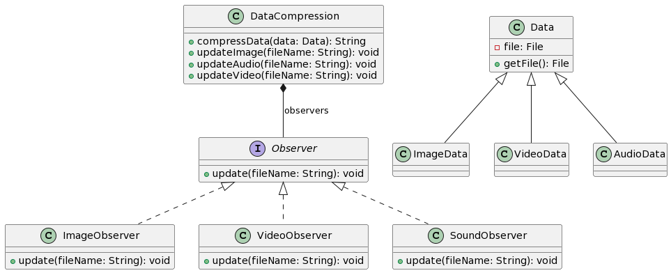
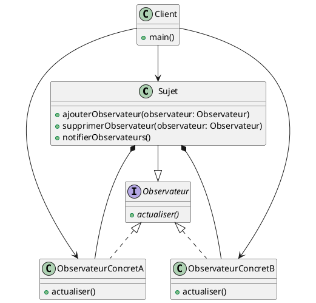
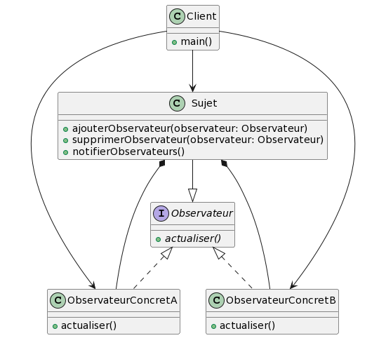

# 1 Patron Stratégie :

## Question 1 :

Le code fourni représente une implémentation antipattern qui viole les principes SOLID, en particulier le principe de responsabilité unique (Single Responsibility Principle - SRP) et le principe d'ouverture/fermeture (Open/Closed Principle - OCP). La classe `DataCompression` contient toutes les fonctions nécessaires pour compresser différents types de données (image, audio, vidéo), ce qui la rend peu évolutive et difficile à maintenir.

Voici le diagramme de classes correspondant en PlantUML pour la solution antipattern :






Problèmes avec la solution antipattern en termes de principes SOLID :

1. **Violation du SRP (Single Responsibility Principle):** La classe `DataCompression` a plusieurs responsabilités, notamment la compression de données et la gestion des observations (updateImage, updateAudio, updateVideo). Cela rend la classe difficile à comprendre, à maintenir et à étendre.

2. **Violation de l'OCP (Open/Closed Principle):** Pour ajouter de nouveaux types de compression, il est nécessaire de modifier la classe `DataCompression`. L'ajout de nouvelles fonctionnalités devrait se faire par extension, et non par modification du code existant.

Pour résoudre ces problèmes, la stratégie de conception peut être utilisée.

### Patron Stratégie (Strategy Pattern) :

1. Création d'une interface `DataCompressionStrategy` avec la méthode `processData(Data data): String`.
2. Création de classes concrètes pour chaque type de traitement (par exemple, `ImageCompressionStrategy`, `AudioCompressionStrategy`, `VideoCompressionStrategy`).
3. La classe `DataCompression` utilise l'interface `DataCompressionStrategy` pour déléguer le traitement aux classes concrètes appropriées.

Cela permet d'atteindre une meilleure séparation des préoccupations et une plus grande flexibilité pour l'ajout de nouveaux types de compression sans modifier la classe principale.


## Question 2 :

Bien sûr, je peux vous donner un exemple de diagramme de classes en PlantUML qui utilise le patron de conception Stratégie. Le patron de conception Stratégie permet de définir une famille d'algorithmes, encapsuler chacun d'eux et les rendre interchangeables. Les clients peuvent alors choisir l'algorithme approprié sans avoir à changer leur code.

Voici un exemple simple de diagramme de classes en PlantUML pour illustrer le patron de conception Stratégie :



Dans cet exemple, la classe `Context` a une référence à une interface appelée `Strategy`. Les classes concrètes `ConcreteStrategyA` et `ConcreteStrategyB` implémentent cette interface. Le client peut choisir une stratégie spécifique en utilisant la méthode `setStrategy`, et l'exécution de la stratégie est réalisée par la méthode `executeStrategy` de la classe `Context`.




## Question 3 :

La solution avec le patron de conception Stratégie résout les problèmes de la solution antipattern et respecte les principes SOLID, en particulier le Single Responsibility Principle (SRP) et l'Open/Closed Principle (OCP).

### Utilisation du patron de conception Stratégie :

1. **Interface `DataCompressionStrategy`:**
    - Une interface `DataCompressionStrategy` est créée avec la méthode `processData(Data data): String`. Cette interface définit le contrat que toutes les stratégies de compression doivent suivre.

   ```java
   public interface DataCompressionStrategy {
       String processData(Data data);
   }
   ```

2. **Classes concrètes pour chaque type de traitement :**
    - Des classes concrètes sont créées pour chaque type de traitement (image, audio, vidéo) en implémentant l'interface `DataCompressionStrategy`. Par exemple, `ImageCompressionStrategy`, `AudioCompressionStrategy`, `VideoCompressionStrategy`.

   ```java
   public class ImageCompressionStrategy implements DataCompressionStrategy {
       // Implémentation de la compression d'image
       // ...
   }

   public class AudioCompressionStrategy implements DataCompressionStrategy {
       // Implémentation de la compression audio
       // ...
   }

   public class VideoCompressionStrategy implements DataCompressionStrategy {
       // Implémentation de la compression vidéo
       // ...
   }
   ```

3. **Modification de la classe `DataCompression`:**
    - La classe `DataCompression` utilise une instance de l'interface `DataCompressionStrategy` au lieu d'avoir des méthodes spécifiques pour chaque type de compression.

   ```java
   public class DataCompression {
       private DataCompressionStrategy compressionStrategy;

       public DataCompression(DataCompressionStrategy compressionStrategy) {
           this.compressionStrategy = compressionStrategy;
       }

       public String compressData(Data data) {
           return compressionStrategy.processData(data);
       }

       // Autres méthodes...
   }
   ```

### Avantages et Respect des Principes SOLID :

1. **Respect du SRP (Single Responsibility Principle):**
    - Chaque classe concrète de stratégie (Image, Audio, Vidéo) a la responsabilité unique de définir comment compresser un type spécifique de données. La classe `DataCompression` se concentre uniquement sur le choix de la stratégie et la délégation du travail à la stratégie appropriée.

2. **Respect de l'OCP (Open/Closed Principle):**
    - L'ajout de nouveaux types de compression se fait par l'ajout de nouvelles classes concrètes implémentant l'interface `DataCompressionStrategy`, sans modifier la classe `DataCompression`. La classe `DataCompression` est ouverte à l'extension mais fermée à la modification.

3. **Meilleure Séparation des Préoccupations :**
    - Les algorithmes de compression sont complètement séparés de la classe principale `DataCompression`, ce qui permet une meilleure modularité et facilite l'extension et la maintenance du code.

En utilisant le patron de conception Stratégie, la solution devient plus flexible, évitable et respectueuse des principes SOLID. De plus, l'ajout de nouveaux types de compression se fait de manière plus propre et sans impacter le code existant.


## Question 4 :

La solution avec le patron de conception Stratégie présente plusieurs avantages par rapport à la solution antipattern. Voici quelques-uns des principaux avantages :

1. **Flexibilité et Extensibilité :**
   - La solution Stratégie permet d'ajouter de nouveaux types de compression de manière facile et propre. Il suffit de créer une nouvelle classe concrète implémentant l'interface `DataCompressionStrategy`, sans modifier le code existant. Cela rend le système plus extensible et évite la modification de classes existantes, conformément au principe OCP.

2. **Séparation des Préoccupations :**
   - La solution Stratégie sépare clairement les algorithmes de compression des détails d'implémentation de la classe principale `DataCompression`. Chaque stratégie a la responsabilité unique de définir comment compresser un type spécifique de données, respectant ainsi le principe SRP.

3. **Réutilisation du Code :**
   - Les classes concrètes de stratégie peuvent être réutilisées dans d'autres contextes ou projets, car elles sont indépendantes de la classe `DataCompression`. Cela favorise la réutilisation du code et permet de bénéficier des implémentations de compression existantes.

4. **Facilité de Maintenance :**
   - La solution Stratégie rend le code plus modulaire et facile à comprendre, car chaque classe a une responsabilité claire. Les modifications ou corrections liées à un type de compression spécifique peuvent être apportées dans la classe de stratégie correspondante sans affecter les autres parties du système.

5. **Meilleure Testabilité :**
   - En utilisant des stratégies distinctes pour chaque type de compression, il est plus facile d'isoler et de tester chaque algorithme de compression individuellement. Cela facilite la création de tests unitaires pour chaque classe de stratégie.

6. **Meilleure Gestion de la Complexité :**
   - La solution Stratégie réduit la complexité de la classe `DataCompression` en déléguant la responsabilité de la compression à des stratégies spécialisées. Cela rend le code plus clair et plus facile à gérer, améliorant ainsi la maintenabilité du système.

En résumé, la solution avec le patron de conception Stratégie offre une meilleure flexibilité, extensibilité, modularité, réutilisabilité et maintenabilité par rapport à la solution antipattern. Elle permet également de respecter les principes SOLID, ce qui conduit à un code plus robuste et évolutif.


## Question 5 :

Voici l'implémentation de la solution avec le patron de conception Stratégie, en ajoutant la classe `DataCompressionStrategy` ainsi que les classes concrètes `ImageCompressionStrategy`, `AudioCompressionStrategy`, et `VideoCompressionStrategy` :

```java
// Nouvelle interface DataCompressionStrategy
public interface DataCompressionStrategy {
    String compress(Data data);
}

// Implémentation de la stratégie pour la compression d'image
public class ImageCompressionStrategy implements DataCompressionStrategy {
    private float quality = 0.5f;

    @Override
    public String compress(Data data) {
        if (data instanceof ImageData) {
            ImageData imageData = (ImageData) data;
            // Logique de compression d'image
            // ...
            return "Compressed image: " + imageData.getFile().getName();
        }
        return "";
    }
}

// Implémentation de la stratégie pour la compression audio
public class AudioCompressionStrategy implements DataCompressionStrategy {
    @Override
    public String compress(Data data) {
        if (data instanceof AudioData) {
            AudioData audioData = (AudioData) data;
            // Logique de compression audio
            // ...
            return "Compressed audio: " + audioData.getFile().getName();
        }
        return "";
    }
}

// Implémentation de la stratégie pour la compression vidéo
public class VideoCompressionStrategy implements DataCompressionStrategy {
    @Override
    public String compress(Data data) {
        if (data instanceof VideoData) {
            VideoData videoData = (VideoData) data;
            // Logique de compression vidéo
            // ...
            return "Compressed video: " + videoData.getFile().getName();
        }
        return "";
    }
}

// Modification de la classe DataCompression pour utiliser la stratégie
public class DataCompression {
    private DataCompressionStrategy compressionStrategy;

    public DataCompression(DataCompressionStrategy compressionStrategy) {
        this.compressionStrategy = compressionStrategy;
    }

    public String compressData(Data data) {
        return compressionStrategy.compress(data);
    }

    // Autres méthodes...
}
```

Dans le fichier `App`, vous pouvez maintenant utiliser ces classes de la manière suivante :

```java
public class App {
    public static void main(String[] args) throws IOException {
        // Vider les dossiers avec les contenus compressés
        File compressionImageFolder = new File("./data/compressed/jpg");
        File compressionAudioFolder = new File("./data/compressed/wav");
        File compressionVideoFolder = new File("./data/compressed/mp4");
        FileWriter.clearFolder(compressionImageFolder);
        FileWriter.clearFolder(compressionAudioFolder);
        FileWriter.clearFolder(compressionVideoFolder);

        // Création des données à traiter
        ArrayList<Data> dataList = new ArrayList<>();
        for (int i = 1; i <= 10; i++) {
            dataList.add(new ImageData(new File("./data/jpg/image" + i + ".jpg")));
            dataList.add(new AudioData(new File("./data/wav/audio" + i + ".wav")));
            dataList.add(new VideoData(new File("./data/mp4/video" + i + ".mp4")));
        }

        // Création du DataCompression avec la stratégie appropriée
        DataCompressionStrategy imageCompressionStrategy = new ImageCompressionStrategy();
        DataCompressionStrategy audioCompressionStrategy = new AudioCompressionStrategy();
        DataCompressionStrategy videoCompressionStrategy = new VideoCompressionStrategy();

        DataCompression imageCompression = new DataCompression(imageCompressionStrategy);
        DataCompression audioCompression = new DataCompression(audioCompressionStrategy);
        DataCompression videoCompression = new DataCompression(videoCompressionStrategy);

        // Traitement des données avec la stratégie de traitement appropriée
        for (Data data : dataList) {
            String result = "";
            if (data instanceof ImageData) {
                result = imageCompression.compressData(data);
            } else if (data instanceof AudioData) {
                result = audioCompression.compressData(data);
            } else if (data instanceof VideoData) {
                result = videoCompression.compressData(data);
            }
            // Vérification du résultat du traitement
            System.out.println("Résultat du traitement : " + result);
        }
    }
}
```

Cette implémentation utilise la flexibilité du patron de conception Stratégie pour déléguer la responsabilité de la compression à des classes spécialisées, respectant ainsi les principes SOLID.


## Question 6 :

Pour répondre à la question 6, nous allons ajouter une méthode `setDataCompressionStrategy` à la classe `DataCompression` qui prendra en charge l'instanciation de la stratégie appropriée en fonction du type de données. Voici comment vous pouvez le faire :

```java
public class DataCompression {
    private DataCompressionStrategy compressionStrategy;

    public void setDataCompressionStrategy(DataCompressionStrategy strategy) {
        this.compressionStrategy = strategy;
    }

    public String compressData(Data data) {
        if (compressionStrategy == null) {
            throw new IllegalStateException("DataCompressionStrategy not set. Please call setDataCompressionStrategy method.");
        }

        return compressionStrategy.compress(data);
    }

    // Autres méthodes...
}
```

Avec cette modification, vous pouvez maintenant définir la stratégie appropriée en appelant la méthode `setDataCompressionStrategy` avant d'appeler la méthode `compressData`. Par exemple :

```java
// ...

// Création du DataCompression
DataCompression dataCompression = new DataCompression();

// Définir la stratégie appropriée en fonction du type de données
dataCompression.setDataCompressionStrategy(new ImageCompressionStrategy());

// Traitement des données avec la stratégie de traitement appropriée
for (Data data : dataList) {
    String result = dataCompression.compressData(data);
    // Vérification du résultat du traitement
    System.out.println("Résultat du traitement : " + result);
}
```

Cela permet de changer dynamiquement la stratégie de compression en fonction du type de données sans modifier la classe `DataCompression`.


## Question 7 :

Pour tester l'implémentation avec l'application principale fournie avec la solution antipattern, vous pouvez adapter le code de l'application principale pour utiliser la nouvelle implémentation avec le patron de conception Stratégie. Voici comment vous pouvez le faire :

```java
public class App {
    public static void main(String[] args) throws IOException {
        // Vider les dossiers avec les contenus compressés
        File compressionImageFolder = new File("./data/compressed/jpg");
        File compressionAudioFolder = new File("./data/compressed/wav");
        File compressionVideoFolder = new File("./data/compressed/mp4");
        FileWriter.clearFolder(compressionImageFolder);
        FileWriter.clearFolder(compressionAudioFolder);
        FileWriter.clearFolder(compressionVideoFolder);

        // Création des données à traiter
        ArrayList<Data> dataList = new ArrayList<>();
        for (int i = 1; i <= 10; i++) {
            dataList.add(new ImageData(new File("./data/jpg/image" + i + ".jpg")));
            dataList.add(new AudioData(new File("./data/wav/audio" + i + ".wav")));
            dataList.add(new VideoData(new File("./data/mp4/video" + i + ".mp4")));
        }

        // Création du DataCompression avec la stratégie appropriée
        DataCompression dataCompression = new DataCompression();

        // Définir la stratégie appropriée en fonction du type de données
        for (Data data : dataList) {
            if (data instanceof ImageData) {
                dataCompression.setDataCompressionStrategy(new ImageCompressionStrategy());
            } else if (data instanceof AudioData) {
                dataCompression.setDataCompressionStrategy(new AudioCompressionStrategy());
            } else if (data instanceof VideoData) {
                dataCompression.setDataCompressionStrategy(new VideoCompressionStrategy());
            }

            // Traitement des données avec la stratégie de traitement appropriée
            String result = dataCompression.compressData(data);
            // Vérification du résultat du traitement
            System.out.println("Résultat du traitement : " + result);
        }
    }
}
```

Cette modification vous permet de tester l'implémentation avec le patron de conception Stratégie en utilisant le même jeu de données que l'application principale de la solution antipattern. Assurez-vous que toutes les classes et interfaces nécessaires sont importées correctement. Vous devriez observer que le résultat du traitement est correctement affiché en fonction du type de données et de la stratégie de compression utilisée.


## Question 8 :

Une extension possible pour l'implémentation du pattern Stratégie pourrait être l'introduction d'une gestion plus dynamique des stratégies. Actuellement, dans l'implémentation fournie, la stratégie est définie de manière statique dans la classe `App` en fonction du type de données. Une extension intéressante pourrait permettre de configurer les stratégies de compression de manière plus flexible, peut-être en utilisant un mécanisme de configuration externe.

Voici une idée d'extension :

1. **Configuration externe des stratégies :** Utiliser un fichier de configuration externe (par exemple, un fichier JSON) pour spécifier quelles stratégies de compression doivent être utilisées pour chaque type de données.

2. **Chargement dynamique des stratégies :** Ajouter un mécanisme qui charge dynamiquement les stratégies à partir de la configuration externe. Cela peut être fait en utilisant la réflexion (reflection) pour créer les instances des classes de stratégie basées sur les informations de configuration.

3. **Flexibilité des stratégies :** Permettre à l'application de changer dynamiquement les stratégies pendant l'exécution. Par exemple, en fonction de certaines conditions métier ou de la charge de travail, l'application pourrait basculer entre différentes stratégies de compression.

Voici un exemple conceptuel de ce à quoi cela pourrait ressembler :

```java
// Extrait de la classe App
public class App {
    public static void main(String[] args) throws IOException {
        // ...

        // Charger les stratégies à partir d'un fichier de configuration externe
        StrategyConfigLoader configLoader = new StrategyConfigLoader("strategies.json");
        Map<Class<? extends Data>, DataCompressionStrategy> strategyMap = configLoader.loadStrategies();

        // Création du DataCompression avec les stratégies chargées
        DataCompression dataCompression = new DataCompression();

        // Définir les stratégies appropriées en fonction du type de données
        for (Data data : dataList) {
            // Utiliser les stratégies chargées ou une stratégie par défaut si non spécifiée
            DataCompressionStrategy strategy = strategyMap.getOrDefault(data.getClass(), new DefaultCompressionStrategy());
            dataCompression.setDataCompressionStrategy(strategy);

            // Traitement des données avec la stratégie de traitement appropriée
            String result = dataCompression.compressData(data);
            // Vérification du résultat du traitement
            System.out.println("Résultat du traitement : " + result);
        }
    }
}
```

Cette extension permettrait une plus grande flexibilité dans la configuration et l'utilisation des stratégies de compression, facilitant ainsi l'ajout, la modification ou la suppression de stratégies sans modifier directement le code source de l'application.


# 2 Patron Observateur : 

## Question 9 :

Pour répondre à la question 9, vous pouvez utiliser le code PlantUML suivant pour représenter le diagramme de classes de la solution antipattern. Le diagramme montre les relations entre les classes `DataCompression`, `ImageObserver`, `VideoObserver`, `SoundObserver`, `ImageData`, `VideoData`, et `AudioData`.





Problème avec la solution antipattern en termes de principes SOLID :

Le problème principal en termes de principes SOLID est la violation du principe de l'ouverture/fermeture (OCP) et du principe de substitution de Liskov (LSP). Actuellement, la classe `DataCompression` est ouverte à la modification à chaque fois qu'un nouveau type de données est introduit. Cela signifie que pour étendre le système avec un nouveau type de données, vous devez modifier la classe existante, ce qui peut conduire à des erreurs et à des difficultés de maintenance. L'utilisation de blocs conditionnels (`if` statements) pour déterminer le type de donnée à traiter est une indication de cette violation.


## Question 10 :

Bien sûr ! Voici un exemple de diagramme de classes en PlantUML qui utilise le patron de conception Observateur :





Dans ce diagramme de classes, vous avez une classe abstraite `Sujet` qui représente le sujet observé. Cette classe a des méthodes pour ajouter, supprimer et notifier des observateurs. L'interface `Observateur` déclare la méthode abstraite `actualiser()` que les observateurs concrets (dans cet exemple, `ObservateurConcretA` et `ObservateurConcretB`) implémentent.

La classe `Client` est présentée ici comme une classe qui utilise le sujet (`Sujet`) et les observateurs concrets (`ObservateurConcretA` et `ObservateurConcretB`).

Notez que l'utilisation du patron de conception Observateur permet à un objet (le sujet) de notifier tous ses observateurs lorsqu'un changement d'état se produit, sans que le sujet ait besoin de connaître les détails de chaque observateur. Chaque observateur réagit à la notification en mettant à jour son état, selon ses propres règles.


## Question 11 :


